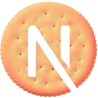

# YouTube Summary Dashboard

YouTube 채널의 모든 비디오를 자동으로 요약하고 관리할 수 있는 개인용 대시보드입니다. Make.com 자동화와 AI 요약을 통해 학습 효율을 극대화하는 도구입니다.



## ✨ 주요 기능

### 🎯 핵심 기능
- **채널 메타정보 자동 수집**: YouTube 채널 ID 입력으로 모든 비디오 메타정보 자동 수집
- **AI 자동 요약**: Make.com 웹훅을 통한 비디오 자막 추출 및 AI 요약 생성
- **직관적인 대시보드**: 캘린더/리스트 뷰로 비디오 요약을 시각적으로 관리
- **강력한 검색**: 제목과 요약 내용을 통한 실시간 검색
- **상세 정보 보기**: Drawer 형태로 전체 요약, 메타데이터, YouTube 링크 제공

### 🚀 고급 기능
- **처리 상태 추적**: AI 요약 완료, STT 처리 완료 등 실시간 상태 표시
- **태그 시스템**: 비디오별 태그 관리로 체계적인 분류
- **웹훅 관리**: Make.com 시나리오별 웹훅 URL 분리 관리
- **글래스모피즘 UI**: 현대적이고 아름다운 사용자 인터페이스
- **반응형 디자인**: 데스크톱, 태블릿, 모바일 최적화

## 🛠️ 기술 스택

### Frontend
- **Next.js 14** - App Router, Server Actions
- **React 19** - 최신 React 기능 활용
- **TypeScript** - 타입 안전성 보장
- **TailwindCSS** - 유틸리티 우선 스타일링
- **shadcn/ui** - 일관된 UI 컴포넌트
- **Lucide React** - 아이콘 시스템

### Backend & Database
- **Supabase** - PostgreSQL 데이터베이스
- **Make.com** - 자동화 워크플로우
- **TanStack Query** - 서버 상태 관리
- **React Hook Form** - 폼 상태 관리
- **Zod** - 스키마 검증

### Development Tools
- **ESLint** - 코드 품질 관리
- **Prettier** - 코드 포맷팅
- **date-fns** - 날짜 처리
- **es-toolkit** - 유틸리티 함수

## 🚀 시작하기

### 사전 요구사항
- Node.js 18+ 
- npm/yarn/pnpm
- Supabase 계정
- Make.com 계정

### 설치

1. **저장소 클론**
```bash
git clone https://github.com/your-username/youtube-summary-dashboard.git
cd youtube-summary-dashboard
```

2. **의존성 설치**
```bash
npm install
# or
yarn install
# or
pnpm install
```

3. **환경변수 설정**
```bash
cp .env.example .env.local
```

`.env.local` 파일에 다음 값들을 설정하세요:
```env
NEXT_PUBLIC_SUPABASE_URL=your_supabase_url
NEXT_PUBLIC_SUPABASE_ANON_KEY=your_supabase_anon_key
```

4. **데이터베이스 마이그레이션**
```bash
# Supabase CLI를 사용하여 마이그레이션 실행
supabase db push
```

5. **개발 서버 실행**
```bash
npm run dev
# or
yarn dev
# or
pnpm dev
```

브라우저에서 [http://localhost:3000](http://localhost:3000)을 열어 확인하세요.

## 📖 사용법

### 1. 채널 메타정보 추가
1. 대시보드에서 "비디오 메타 정보 추가" 버튼 클릭
2. YouTube 채널 ID 입력 (UC로 시작하는 24자리)
3. Make.com 웹훅이 자동으로 채널의 모든 비디오 처리

### 2. 비디오 요약 확인
1. 대시보드에서 비디오 카드 클릭
2. Drawer에서 전체 요약 및 메타데이터 확인
3. "YouTube에서 열기" 링크로 원본 비디오 이동

### 3. 검색 및 필터
1. 상단 검색창에 키워드 입력
2. 제목과 요약 내용에서 실시간 검색
3. 캘린더/리스트 뷰 전환으로 다양한 방식으로 조회

### 4. 설정 관리
1. 사이드바에서 "Settings" 클릭
2. Make.com 웹훅 URL 설정
3. 비디오 요약용, 채널 메타정보용 웹훅 분리 관리

## 🔧 Make.com 설정

### 필요한 웹훅
1. **채널 메타정보 웹훅**: YouTube RSS 피드 처리
2. **비디오 요약 웹훅**: 개별 비디오 자막 추출 및 요약

### 웹훅 플로우
```
채널 ID 입력 → Make.com RSS 처리 → 각 비디오별 요약 생성 → Supabase 저장 → 대시보드 표시
```

## 📁 프로젝트 구조

```
src/
├── app/                    # Next.js App Router
│   ├── api/               # API 라우트
│   ├── dashboard/         # 대시보드 페이지
│   └── settings/          # 설정 페이지
├── components/            # React 컴포넌트
│   ├── layout/           # 레이아웃 컴포넌트
│   ├── ui/               # shadcn/ui 컴포넌트
│   └── video/            # 비디오 관련 컴포넌트
├── hooks/                # 커스텀 훅
├── lib/                  # 유틸리티 및 설정
└── types/                # TypeScript 타입 정의
```

## 🗄️ 데이터베이스 스키마

주요 테이블:
- `channel`: 채널 정보
- `video_summary`: 비디오 요약 및 메타데이터
- `tag`: 태그 정보
- `video_tag`: 비디오-태그 관계
- `settings`: 애플리케이션 설정
- `pending_job`: 웹훅 처리 상태

자세한 스키마는 `doc/4) ERD.md`를 참조하세요.

## 🚀 배포

### Vercel 배포
1. GitHub에 코드 푸시
2. Vercel에 저장소 연결
3. 환경변수 설정
4. 자동 배포 완료

### 환경변수 (프로덕션)
```env
NEXT_PUBLIC_SUPABASE_URL=your_production_supabase_url
NEXT_PUBLIC_SUPABASE_ANON_KEY=your_production_supabase_anon_key
```

## 📚 문서

- [PRD (Product Requirements Document)](doc/1)%20PRD.md)
- [IA (Information Architecture)](doc/2)%20IA.md)
- [Use Case 문서](doc/3)%20Use-Case.md)
- [ERD (Entity Relationship Diagram)](doc/4)%20ERD.md)
- [Design 문서](doc/5)%20Design.md)

## 🤝 기여하기

1. Fork the Project
2. Create your Feature Branch (`git checkout -b feature/AmazingFeature`)
3. Commit your Changes (`git commit -m 'Add some AmazingFeature'`)
4. Push to the Branch (`git push origin feature/AmazingFeature`)
5. Open a Pull Request

## 📄 라이센스

이 프로젝트는 MIT 라이센스 하에 배포됩니다. 자세한 내용은 `LICENSE` 파일을 참조하세요.

## 📞 지원

문제가 있거나 질문이 있으시면 [Issues](https://github.com/your-username/youtube-summary-dashboard/issues)를 통해 문의해주세요.

---

**YouTube Summary Dashboard**로 YouTube 학습을 더 효율적으로 만들어보세요! 🎉
